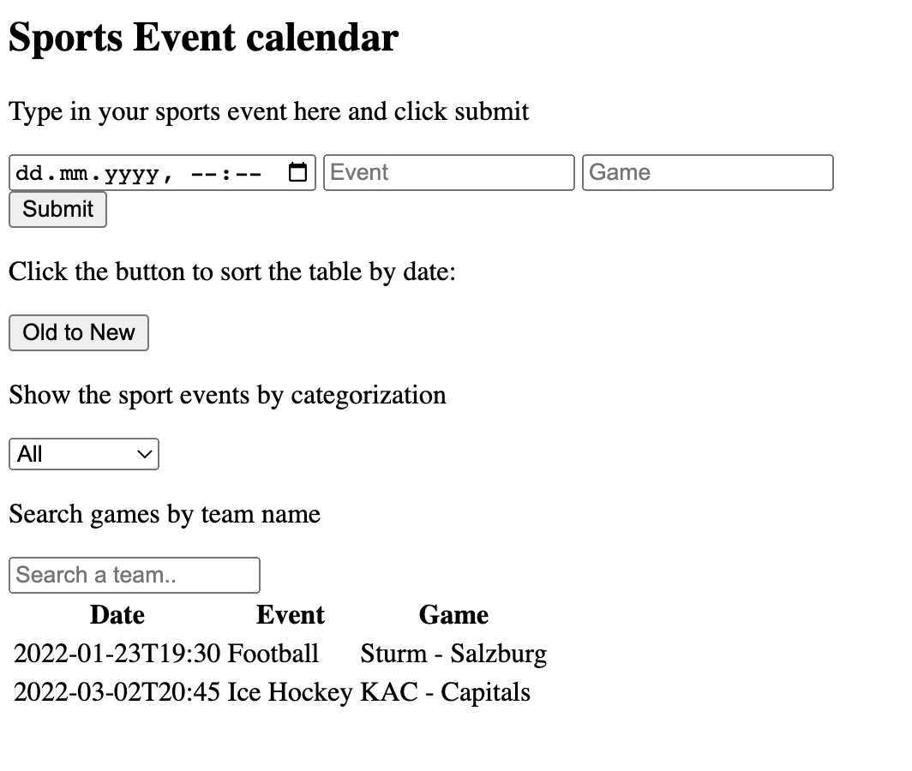
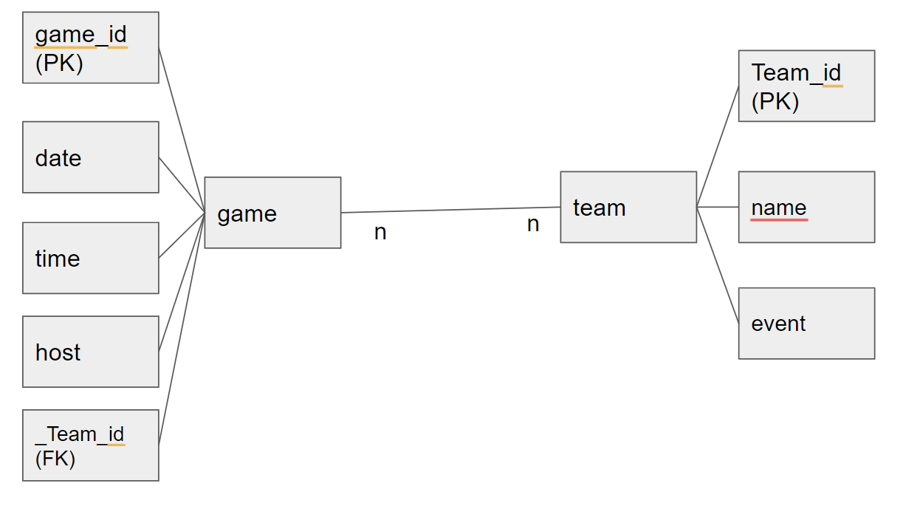
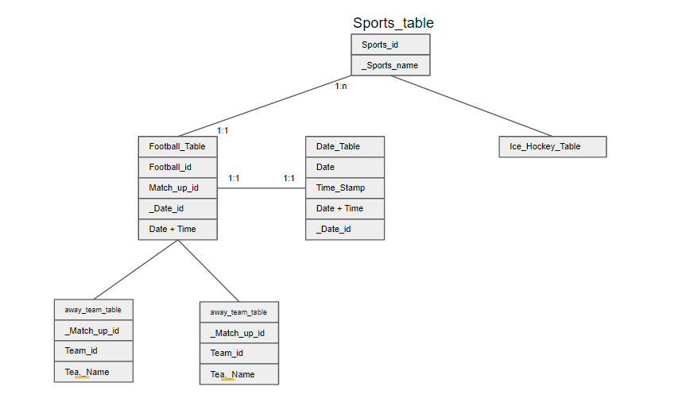

## Here you can see the solution to implement a sports event calender.

### Features implemented: 
1. Fill in new sport events. I deliberately decided to let the user fill in event types via open text field instead of given options. This gives the end user more flexibility but is also more prone to errors, typos etc.
2. Sort by date.
3. Show sport events by categorization
4. Search games by team name.

Here you can see how the website looks in action:

Here is a simple ERD an a more sophisticated for better performance:
For the sake of simplicity I set up only 1 table for this exercise.

